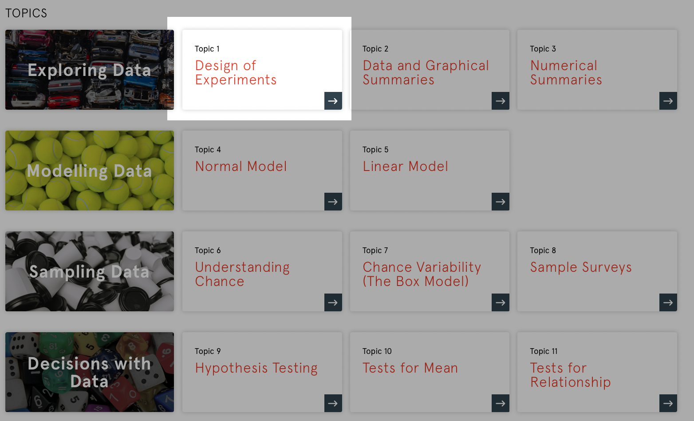
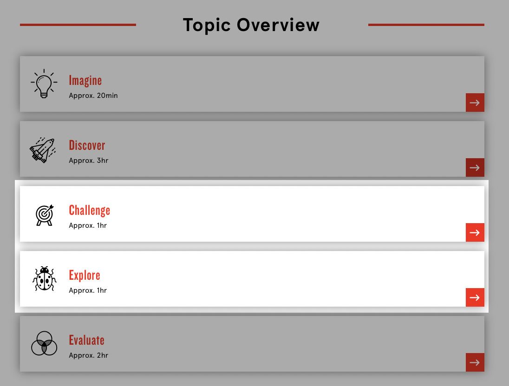

# [fit] **_DATA1901_** Lab*01*

## [fit] Topic One

---

## [fit] Welcome to data science

---

## [fit] About **_Us_**

-   What are you studying?
-   What languages do you speak? (verbal and coding)
-   When you first started coding in R, how did you find it?

---

## [fit] About **_You_**

-   What is your major / degree?
-   What languages do you speak? (verbal and coding)
-   What are you most excited for in university?
-   [http://tiny.cc/vlpouz](http://tiny.cc/vlpouz)
-   Swap contact details / start a group chat

---

---

---

## [fit] Challenge

---

## [fit] Key Ideas

-   Ethics and Privacy
-   Statistical thinking
-   Randomised Controlled Trial (RCT) vs Observational Study
-   Domain knowledge
-   Confounders
-   Precautions with observational studies

---

## [fit] Group Work

---

## [fit] Take a

## [fit] **_Break_**

---

## [fit] Explore

---

## [fit] R

---

## [fit] Reminders

-   Add your group members on socials / email
-   Work through the extra practice in **challenge**
-   Complete the **evaluate quiz**
-   Go to the **evaluate lecture** on Friday
