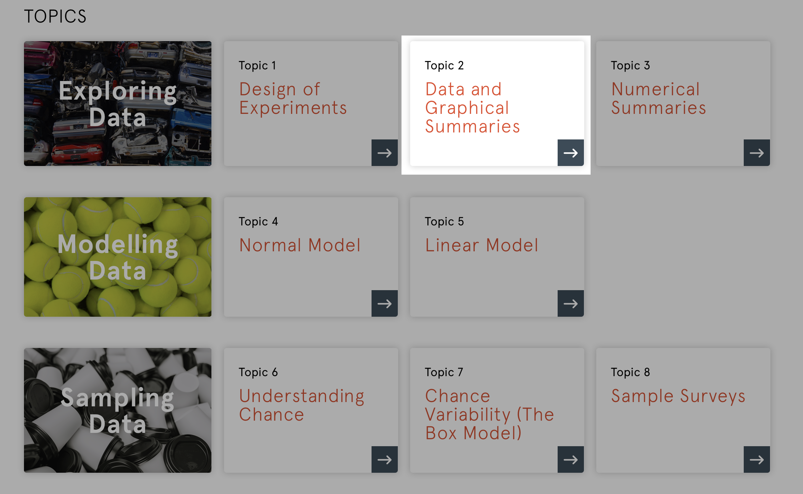
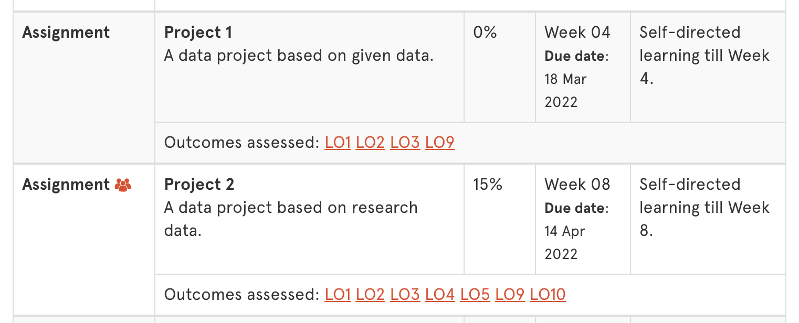

# [fit] **_DATA1901_** Lab*01*

## [fit] Topic Two

---

## [fit] **_Welcome Back_**

It's important to develop a professional approach to your study aligned with your personal values. It's helpful to join LinkedIn and to start writing your CV.

-   Did you / do you have any ideas of where you want to be after uni?
-   We all need to juggle work, study and 'play'. How do you balance uni with everything else in life?

---

---

## [fit] Projects

---

## [fit] Challenge

---

## [fit] Group Work

---

## [fit] Take a

## [fit] **_Break_**

---

## [fit] Explore

---

## [fit] R Demo

---

## [fit] **_Your Turn_**

---

## [fit] Reminders

-   Look at Project One
-   Masterclass next week
-   Complete the **evaluate quiz** (optional)
-   Go to the **evaluate lecture** on Friday
