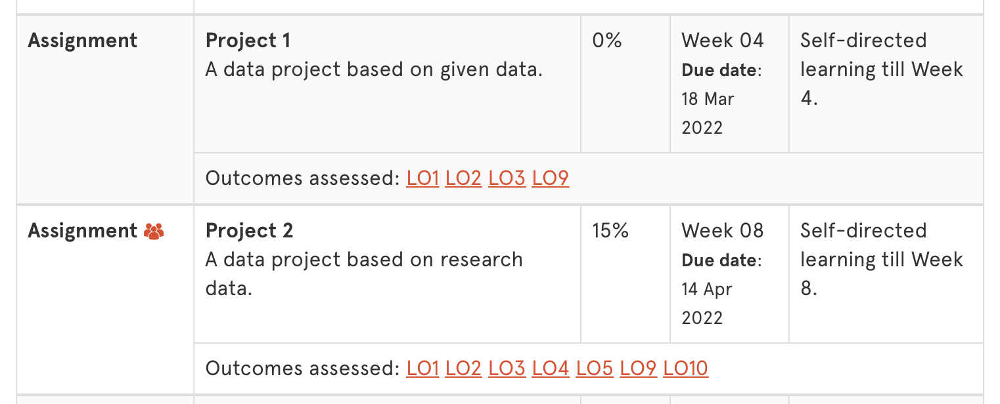

# [fit] **_DATA1901_** Lab*01*

## [fit] Topic Four

---

## [fit] **_Master_**class

---

## [fit] Projects

---

## [fit] Challenge

---

## [fit] Group Work

---

## [fit] Take a

## [fit] **_Break_**

---

## [fit] Explore

---

## [fit] R Demo

---

## [fit] **_Your Turn_**

---

## [fit] Reminders

- Project 1 due *this Friday* (March 18) 
- Finish any parts of the lab you missed
- Look at the challenge sections
